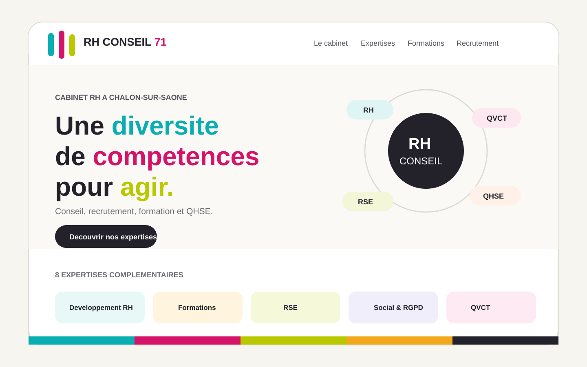

# RH Conseil 71

Site vitrine moderne de **RH Conseil 71**, cabinet basé à Chalon-sur-Saône. Le projet présente les expertises du cabinet, ses formations, ses accompagnements pour les particuliers et son activité de recrutement dans une interface responsive construite avec React et TypeScript.



## Objectifs

- conserver l'identité multicolore historique de RH Conseil 71 ;
- moderniser la hiérarchie visuelle et l'expérience de navigation ;
- présenter clairement les huit expertises du cabinet ;
- valoriser la formation et la certification Qualiopi ;
- distinguer les parcours entreprises, particuliers et candidats ;
- proposer des animations professionnelles sans nuire à la lisibilité ;
- offrir une expérience responsive sur ordinateur, tablette et mobile.

## Contenu du site

La page est organisée autour des sections suivantes :

- **Accueil** : promesse de marque, accès rapide aux expertises et mise en avant de Qualiopi ;
- **Expertises** : cartes interactives permettant d'afficher les prestations et formations associées ;
- **Le cabinet** : présentation de l'approche, de la proximité et du fonctionnement de l'équipe ;
- **Équipe** : mise en avant de la complémentarité des disciplines ;
- **Formations** : sélection de formations et lien vers le catalogue externe ;
- **Particuliers** : bilan de compétences, transition professionnelle et outplacement ;
- **Recrutement** : parcours dédié aux entreprises et aux candidats ;
- **Contact** : coordonnées et formulaire préparant un e-mail dans le logiciel de messagerie du visiteur.

Les domaines présentés couvrent notamment le développement RH, la formation, la RSE, le social / RGPD, le management des carrières, le QHSE, la QVCT et le recrutement.

## Stack technique

- React 18 ;
- TypeScript ;
- Vite 5 ;
- Framer Motion pour les animations ;
- Lucide React pour les icônes.

## Structure principale

```text
.
├── explications/
│   ├── apercu-site.svg
│   ├── explications-site.pdf
│   └── video-test-1s.html
├── src/
│   ├── components/
│   │   ├── BrandLogo.tsx
│   │   └── Reveal.tsx
│   ├── data/
│   │   └── content.ts
│   ├── App.tsx
│   ├── main.tsx
│   └── styles.css
├── index.html
├── package.json
├── tsconfig.json
└── vite.config.ts
```

`src/App.tsx` compose les différentes sections, gère les interactions et le formulaire de contact. `src/data/content.ts` centralise les contenus structurés des expertises. Les composants `BrandLogo` et `Reveal` isolent respectivement le logo et l'animation d'apparition au défilement.

## Développement

Installer les dépendances :

```bash
npm install
```

Lancer le serveur de développement :

```bash
npm run dev
```

Créer la version de production :

```bash
npm run build
```

Prévisualiser la version de production :

```bash
npm run preview
```

## Formulaire de contact

Le formulaire fonctionne sans serveur. Lors de l'envoi, le site construit un lien `mailto:` avec le sujet et le contenu de la demande puis ouvre le logiciel de messagerie du visiteur. Le message est destiné à `accueil@rhconseil71.com`.

## Documentation et médias de démonstration

Le dossier [`explications`](explications/) regroupe les éléments demandés pour documenter et tester le site :

- [`explications-site.pdf`](explications/explications-site.pdf) : document de présentation et d'explication technique, avec une illustration raster du site intégrée dans le PDF ;
- [`apercu-site.svg`](explications/apercu-site.svg) : illustration vectorielle représentant la page d'accueil et l'identité visuelle du site ;
- [`video-test-1s.html`](explications/video-test-1s.html) : page autonome contenant une vidéo WebM de **1,000 seconde** embarquée directement en base64 afin qu'elle reste transportable dans un changeset textuel.

Pour tester la vidéo, ouvrir `explications/video-test-1s.html` dans un navigateur compatible WebM puis utiliser les contrôles du lecteur si la lecture automatique est bloquée.

## Liens utiles

- Catalogue de formations : <https://rhconseil.catalogueformpro.com/>
- LinkedIn : <https://fr.linkedin.com/company/rh-conseil-71>
- Contact : <mailto:accueil@rhconseil71.com>
